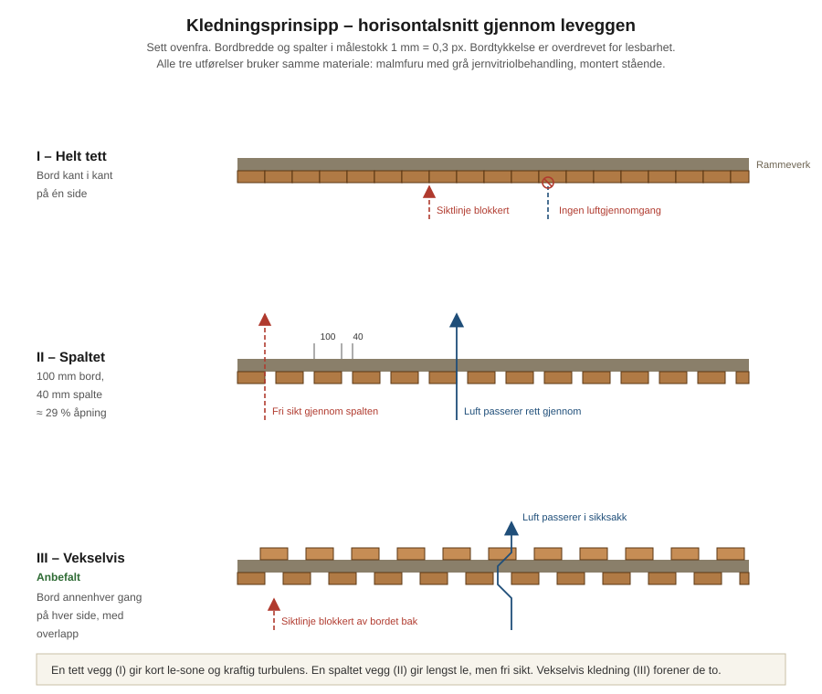
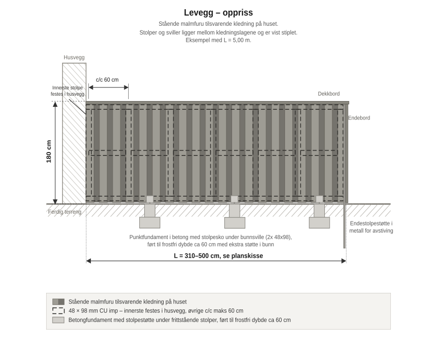
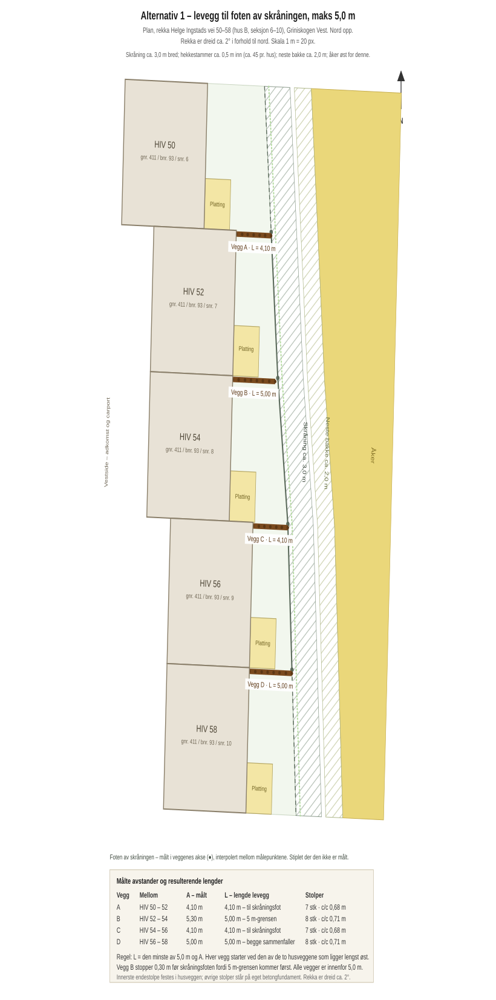
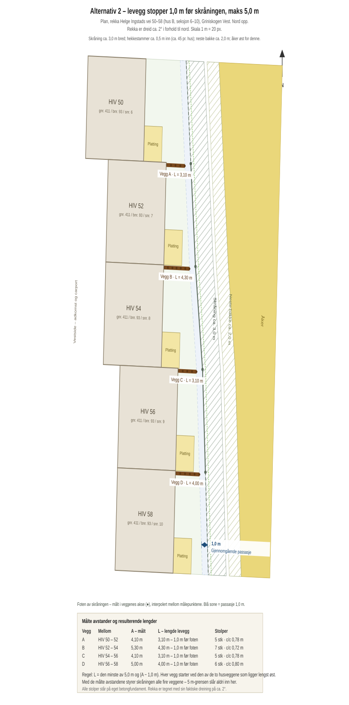

# Designbeskrivelse – levegger i rekka Helge Ingstads vei 50–58

| | |
|---|---|
| **Eiendom** | gnr. 411 bnr. 93, Indre Østfold kommune (3118), Helge Ingstads vei, 1820 Spydeberg |
| **Sameie** | Boligsameiet Griniskogen Vest |
| **Bygg** | Hus B – kjedete boliger, rekka HIV 50–58 (seksjon 6–10), 5 boliger, orientert nord–sør |
| **Forslagsstiller** | Seksjon 7, Helge Ingstads vei 52 |
| **Tiltak** | Fire levegger, én i hvert skille mellom boligene, østover fra østfasaden |
| **Dokumentversjon** | Utkast, 2. august 2026 |

## 1. Formål

Uteoppholdsarealene mellom boligene i rekka er i dag helt uskjermet. Rekka går nord–sør, og
uteoppholdsarealene ligger på **østsiden** av boligene. Uteplassene ligger rett ved siden av
hverandre uten noen form for skille, slik at innsyn er fritt begge veier og bruken av egen uteplass
i praksis foregår i naboens synsfelt. Leveggene går østover fra husenes østfasade, i skillet mellom
uteoppholdsarealene. Tiltaket skal gi skjerming mot innsyn og vind, uten å endre inntrykket av rekka
utvendig.

Forslaget omfatter **hele rekka**, ikke bare skillene mot seksjon 7. Sameiets trivsels- og
ordensregler punkt 3 sier at «det bør tilstrebes å finne felles løsninger for å opprettholde et
enhetlig og moderne uttrykk på boenhetene», og vedtektene punkt 5.3 forutsetter at utvendige
endringer skjer etter «en samlet plan». En rekke på fem like boliger bør ha én løsning framfor fem
varianter som oppstår etter hvert som den enkelte tar sitt eget initiativ. Forslaget legges derfor
fram som et ferdig designgrunnlag for hele rekka, slik at styret kan ta stilling til utformingen én
gang.

## 2. Rekka og partene

Boligene ligger i rekkefølge fra nord mot sør: HIV 50, 52, 54, 56 og 58.

Husene står **ikke** på linje. Østfasadene er forskjøvet i to trinn på om lag 2,8 m hver:

| Hus | Østfasadens plassering |
|-----|------------------------|
| HIV 50 | 3,8 m lenger vest enn HIV 52 |
| HIV 52 | I flukt med HIV 54 |
| HIV 54 | 1,8 m lenger vest enn HIV 56 |
| HIV 56 | I flukt med HIV 58 |
| HIV 58 | Referanse, lengst øst |

Samlet ligger HIV 50 altså 5,6 m lenger vest enn HIV 58.

Husrekka er dessuten dreid om lag 2° i forhold til nord, mot øst i nordenden. Dreiningen er tegnet
inn i planskissene.

> [!NOTE]
> Forskyvningene bygger på observasjon på stedet, sammenholdt med
> [situasjonsplanen for 411/93](../Salgsdokumenter/Kontraktsvedlegg/411-93%20Situasjonsplan.pdf) og
> flyfoto. Den samlede forskyvningen på 5,6 m er godt underbygget, mens fordelingen mellom de to
> trinnene er anslått. Begge trinnene bør kontrollmåles med målebånd før tegningene brukes som
> arbeidsgrunnlag. Se [`Avklaringer.md`](Avklaringer.md) punkt 1.10.

> [!IMPORTANT]
> Hver levegg starter ved den av de to husveggene som ligger lengst øst. Ved vegg A betyr det
> østfasaden på HIV 52, og ved vegg C østfasaden på HIV 56. Dette er lagt til grunn både i
> tegningene og i de målte avstandene.

| Vegg | Mellom | Seksjoner | Parter |
|------|--------|-----------|--------|
| **A** | HIV 50 og HIV 52 | 6 og 7 | Trond og Therese Nessestrand · Marius og Sigrid Storhaug |
| **B** | HIV 52 og HIV 54 | 7 og 8 | Marius og Sigrid Storhaug · Hugo Wilhelmsen og Lill Kristin Hagen |
| **C** | HIV 54 og HIV 56 | 8 og 9 | Hugo Wilhelmsen og Lill Kristin Hagen · Trekanten AS |
| **D** | HIV 56 og HIV 58 | 9 og 10 | Trekanten AS · Andreas Takvam og Hanne Kjersti Vikeby |

### Målte avstander

Avstanden `A` fra østfasaden til foten av skråningen er målt i hver veggs akse 2. august 2026:

| Vegg | Mellom | A – målt avstand |
|------|--------|------------------|
| A | HIV 50 og HIV 52 | **4,10 m** |
| B | HIV 52 og HIV 54 | **5,30 m** |
| C | HIV 54 og HIV 56 | **4,10 m** |
| D | HIV 56 og HIV 58 | **5,00 m** |

Skråningen følger altså ikke rekka parallelt. Avstanden varierer med 1,20 m mellom det korteste og
det lengste snittet, og det gir ulik lengde på veggene i begge alternativer.

Eierforholdene er hentet fra grunnboksutskriftene i
[`Storhaug-ting/GriniskogenVest`](https://github.com/Storhaug-ting/GriniskogenVest/tree/main/Grunnb%C3%B8ker).

> [!IMPORTANT]
> **Seksjon 9 (HIV 56) er ikke solgt.** Hjemmelshaver er Trekanten AS, som også er utbygger.
> Selskapet er derfor part i vegg C og vegg D inntil boligen selges. Det taler for å få
> utformingen vedtatt som en felles standard nå, mens det er én part å forholde seg til – og slik
> at en framtidig kjøper overtar en avklart løsning framfor å måtte ta saken opp på nytt.

Veggene kan settes opp uavhengig av hverandre og i den takten partene blir enige om. Godkjenningen
gjelder utformingen, ikke tidspunktet.

## 3. Utforming

### 3.1 Materialer og uttrykk

Leveggen utføres i **malmfuru med grå jernvitriolbehandling**, montert **stående** – samme materiale,
samme profil og samme overflatebehandling som husets kledning.

Det avgjørende for uttrykket er at leveggen leses som en forlengelse av huset og ikke som et
tilført element. Materialet gråner likt med huset over tid, slik at fargeforskjellen som oppstår
i starten jevner seg ut av seg selv.

| Del | Utførelse |
|-----|-----------|
| Stolper | 98 × 98 mm, c/c maks 0,80 m. Alle stolper står på eget betongfundament |
| Rammeverk | Vannrette sviller i topp, midt og bunn, bak kledningen |
| Kledning | Malmfuru, montert **stående og vekselvis på begge sider**, samme profil og bredde som husets kledning |
| Overflatebehandling | Jernvitriol som gir grå patina, samme blanding og påføring som huset |
| Toppavslutning | Gjennomgående dekkbord som beskytter endeved mot nedbør |
| Innfesting | **A4 syrefaste** skruer og beslag – jernvitriol angriper sink og gir mørke renner på galvanisert stål |
| Fundament | Punktfundament i betong, diameter minst 250 mm, med stolpesko i A4, **under hver stolpe**. Dybde minst 1,0 m i drenert grunn, 1,2 m i telefarlig grunn |
| Avstand til bakken | **Minst 200 mm** fra ferdig terreng til nederste kledningsbord |

> [!IMPORTANT]
> Stolpesko framfor nedgravd stolpe er valgt bevisst. Nedgravd trevirke råtner i overgangen mellom
> jord og luft, og en levegg som må skiftes om ti år er en dårligere løsning for sameiet enn en som
> står i tretti.
>
> Jernvitriol er et fargestoff, ikke et treverntiltak. Behandlingen gir ingen beskyttelse mot råte.
> Levetiden avgjøres derfor av detaljene – lufting, avstand til bakken og beskyttet endeved.

### 3.2 Tett eller spaltet vegg

Uteoppholdsarealene ligger åpent og vindutsatt til. En helt tett vegg er da ikke det opplagte
valget den kan virke som:

| Utførelse | Le-sone bak veggen | Turbulens | Vindlast på konstruksjonen | Snø på lesiden |
|-----------|--------------------|-----------|----------------------------|----------------|
| Helt tett | ca. 9–13 m | Kraftig virvel, kastevind | Høyest | Markert fonn |
| Spaltet, 30–40 % åpning | ca. 18–27 m | Svak og jevn | Om lag halvparten | Vesentlig mindre |

Luften som passerer over en tett vegg slår ned igjen et stykke bak den, og der kan vinden bli like
sterk som før veggen – bare mer kastevis. En vegg som slipper gjennom noe luft demper
trykkforskjellen, virvelen blir svakere, og le-sonen strekker seg mer enn dobbelt så langt bakover.

Tre utførelser er vurdert i [`Byggeteknikk.md`](Byggeteknikk.md) punkt 3. Alle bruker samme
materiale og samme stående montering, og ser like ut på avstand:

| | Innsynsskjerming | Vindskjerming |
|---|---|---|
| **I – helt tett** | Fullstendig | Kort le-sone, mye turbulens |
| **II – spaltet** | Fri sikt rett gjennom vinkelrett på veggen | Best |
| **III – vekselvis kledning på begge sider** | Fullstendig, ingen gjennomgående siktlinje | Bedre enn tett, ikke like god som spaltet |

> [!TIP]
> **Alternativ III anbefales.** Bordene monteres annenhver gang på hver side av rammeverket, med
> overlapp slik at det ikke finnes noen rett siktlinje gjennom veggen, mens luften slipper gjennom i
> sikksakk. Det gir full innsynsskjerming og samtidig mindre turbulens og lavere vindlast enn en
> helt tett vegg. Veggen ser dessuten identisk ut fra begge sider, noe som er en praktisk fordel når
> den står i grenselinjen mellom to seksjoner – ingen får «baksiden».
>
> Gevinsten er reell, men mindre enn ved en ren spaltet vegg. Valget mellom I, II og III bør tas
> sammen med naboene.

### 3.3 Mål

| Mål | Verdi | Begrunnelse |
|-----|-------|-------------|
| Høyde | 1,8 m over ferdig terreng | Maksimal høyde uten søknadsplikt, jf. SAK10 § 4-1 første ledd bokstav f. Gir reell skjerming for stående person. |
| Lengde | 3,10–5,00 m, se punkt 4 | Fastsatt av avstanden til skråningen og 5,0 m-grensen. Alle vegger holder seg innenfor bokstav f nr. 2, som tillater plassering inntil nabogrensen. |
| Stolpedimensjon | 98 × 98 mm | Alminnelig dimensjon for levegg på 1,8 m |
| Stolpeavstand | c/c maks 0,80 m | Tett stolpeavstand gir god innfesting for den stående kledningen og en svært stiv vegg. Alle stolper føres til frostfritt betongfundament. |
| Avstand til bakken | Minst 200 mm | Forlenger levetiden på nederste bord, og demper samtidig undertrykket under veggen |

Terrenget faller mot skråningen. Dersom fallet er merkbart over leveggens lengde, trappes veggen
ned i seksjoner slik at overkant følger et jevnt trappemønster framfor å stå på skrå. Høyden på
1,8 m måles i hvert punkt fra ferdig terreng, slik regelverket krever. Endelig løsning fastsettes
når terrengfallet er målt, jf. [`Avklaringer.md`](Avklaringer.md) punkt 1.3.

## 4. To alternativer

Alternativene skiller seg kun i **hvor langt ut leveggen føres**. Materialbruk, høyde, konstruksjon
og utførelse er identisk, og samme alternativ bør velges for hele rekka slik at uttrykket blir
enhetlig.

### Alternativ 1 – fram til skråningsfoten, maks 5,0 m

Leveggen føres 5,0 m østover fra østfasaden, eller helt fram til foten av skråningen dersom
skråningen kommer først. Lengden er den minste av 5,0 m og `A`.

| Vegg | A | Lengde | Merknad |
|------|---|--------|---------|
| A | 4,10 m | **4,10 m** | Går helt til skråningsfoten |
| B | 5,30 m | **5,00 m** | Stopper 0,30 m før foten – 5,0 m-grensen kommer først |
| C | 4,10 m | **4,10 m** | Går helt til skråningsfoten |
| D | 5,00 m | **5,00 m** | Grensen og skråningsfoten sammenfaller |

Samlet lengde: 18,20 m fordelt på fire vegger.

### Alternativ 2 – stopper 1,0 m før skråningsfoten, maks 5,0 m

Leveggen stopper 1,0 m før foten av skråningen, eller ved 5,0 m dersom det kommer først. Lengden er
den minste av 5,0 m og `A − 1,0 m`.

| Vegg | A | Lengde | Merknad |
|------|---|--------|---------|
| A | 4,10 m | **3,10 m** | Avstanden til skråningen styrer |
| B | 5,30 m | **4,30 m** | Avstanden til skråningen styrer |
| C | 4,10 m | **3,10 m** | Avstanden til skråningen styrer |
| D | 5,00 m | **4,00 m** | Avstanden til skråningen styrer |

Samlet lengde: 14,50 m fordelt på fire vegger. 5,0 m-grensen slår aldri inn i dette alternativet.

### Sammenligning

| | Alternativ 1 | Alternativ 2 |
|---|---|---|
| Lengder | 4,10 · 5,00 · 4,10 · 5,00 m | 3,10 · 4,30 · 3,10 · 4,00 m |
| Samlet lengde | 18,20 m | 14,50 m |
| Skjerming | Tre av fire vegger går helt ut til skråningen | Alle stopper 1,0 m før – vegg A og C blir bare 3,10 m |
| Passasje langs skråningen | Ingen | Gjennomgående for hele rekka |
| Vedlikehold av skråningen | Må gjøres fra egen side av veggen | Kan gjøres fra begge sider uten å gå rundt |
| Snø og løv | Kan samle seg i hjørnet mellom vegg og skråning | Luftes ut gjennom åpningen |
| Materialforbruk | Ca. 25 % høyere | Lavere |

> [!IMPORTANT]
> Etter oppmålingen er forskjellen mellom alternativene større enn antatt. Vegg A og C blir bare
> 3,10 m i alternativ 2 – 1,00 m kortere enn i alternativ 1. Med en uteplass som ligger nær huset
> gir 3,10 m fortsatt god skjerming, men skjermingen blir mindre jo lenger ut på arealet man
> oppholder seg. Dette bør veies mot verdien av en gjennomgående passasje.

> [!NOTE]
> Valget mellom alternativene er i hovedsak et spørsmål om hvorvidt det er ønskelig å kunne gå
> langs skråningsfoten på tvers av rekka. Alternativ 2 gir en sammenhengende passasje bak alle fem
> boligene. Dette er et forhold naboene og styret er nærmere til å vurdere enn forslagsstiller
> alene.

Begge alternativene holder alle fire vegger innenfor 5,0 m. Hjemmelen i
[SAK10 § 4-1](https://lovdata.no/forskrift/2010-03-26-488/%C2%A74-1) første ledd bokstav f nr. 2
gjelder derfor uansett hvilket alternativ som velges, og det er ikke behov for noen minsteavstand
til grensen mellom seksjonene.

## 5. Rettslig grunnlag

Utfyllende gjennomgang med kildehenvisninger ligger i [`Regelverk.md`](Regelverk.md). Kort
oppsummert:

- Levegg med høyde inntil 1,8 m og lengde inntil 5,0 m er unntatt søknadsplikt og kan plasseres
  inntil nabogrensen, jf. [SAK10 § 4-1](https://lovdata.no/forskrift/2010-03-26-488/%C2%A74-1)
  første ledd bokstav f nr. 2.
- Det er **ingen meldeplikt** til kommunen for levegg. Meldeplikten gjelder bare bygninger og
  tilbygg etter bokstav a, b og c.
- Unntaket forutsetter at tiltaket ikke strider mot reguleringsplan eller kommuneplan. Eiendommen
  er regulert i detaljplanen «Griniskogen nordvest» (PlanID 3014_012320120011). Planen forbyr ikke
  levegger. § 4.3 krever at «gjerder/avskjerming» skal gis en estetisk utforming som harmonerer med
  boligbebyggelsen – nettopp det materialvalget her svarer på – og § 4.1 tillater mindre
  frittstående anlegg utenfor byggegrensen. Kommuneplanens bestemmelse om levegg gjelder kun
  fritidsboliger.
- Leveggene skal holde seg innenfor arealformålet **B1 boligbebyggelse**, og ikke føres inn i
  vegetasjonsskjermen som løper langs østsiden av planområdet.
- [Grannelova § 6](https://lovdata.no/lov/1961-06-16-15) krever at naboene varsles i rimelig tid på
  forhånd. Her ivaretas dette ved at alle eierne i rekka involveres i utformingen før arbeidet
  starter.
- Utearealet er **fellesareal med enerett**, jf. sameiets vedtekter pkt. 2.4. Vedtektene pkt. 5.3
  krever forutgående godkjenning av styret når seksjonseier selv utfører utvendige arbeider.
- Fire levegger på samme matrikkelenhet kan i prinsippet bli vurdert samlet av kommunen, jf. DiBKs
  veiledning om at «mange mindre tiltak som utgjør en større helhet må ses samlet». Veggene står
  fritt fra hverandre med hele hagebredder imellom og danner ingen sammenhengende konstruksjon,
  men forholdet er tatt opp uttrykkelig med kommunen.

Alle fire vegger holder seg innenfor 5,0 m og krever derfor ingen minsteavstand til grensen mellom
seksjonenes utearealer.

## 6. Behandling i sameiet

Sameiets trivsels- og ordensregler punkt 3 krever skriftlig søknad til styret før levegg settes opp,
og fastsetter en seksstegs prosedyre. Forslaget er bygget opp for å oppfylle den:

| Krav i ordensreglene punkt 3 | Hvordan det er oppfylt |
|------------------------------|------------------------|
| 1 – Skriftlig søknad til styret før iverksettelse | [`Mail/2026-08-02-Styret-soknad-om-godkjenning.md`](Mail/2026-08-02-Styret-soknad-om-godkjenning.md) |
| 2 – Beskrivelse og illustrasjonstegninger | Dette dokumentet og [`Tegninger/`](Tegninger/) |
| 3 – Tekniske undersøkelser innhentet og bekostet av søker | [`Regelverk.md`](Regelverk.md). Oppmåling og kontroll av ledninger i grunnen gjenstår |
| 4 – Skriftlig samtykke fra berørte naboer | [`Naboerklaering.md`](Naboerklaering.md), én per vegg |
| 5 – Styret/årsmøtet vurderer | Styrets beslutning |
| 6 – Skriftlig samtykke før iverksettelse | Ingenting settes i gang før dette foreligger |

> [!IMPORTANT]
> Punkt 4 er verdt å merke seg: er det uklart hvilke naboer som berøres, **må** saken til årsmøtet.
> Ved å hente skriftlig samtykke fra samtlige eiere i rekka på forhånd fjernes den uklarheten, og
> styret står fritt til å behandle saken selv.

Forslagsstiller ber ikke om å få avgjøre saken selv. Forslaget legges fram for styret med følgende
spørsmål:

1. Kan styret godkjenne utformingen slik den er beskrevet her, jf. ordensreglene punkt 3 og
   vedtektene punkt 5.3?
2. Kan forslaget vedtas som en **felles standard for hele rekka HIV 50–58**, slik at hver enkelt
   vegg kan settes opp når partene er klare og naboerklæringen er signert, uten ny behandling?
3. Behandler styret saken selv, eller skal den til årsmøtet? Mener styret at tiltaket går ut over
   vanlig forvaltning, kreves 2/3 flertall etter vedtektene punkt 7.9 bokstav a.
4. Hvordan skal eierskap og vedlikeholdsplikt dokumenteres for en vegg som står mellom to
   seksjoners enerettsarealer?

Punkt 2 er det som gir sameiet mest igjen. Både ordensreglene og vedtektene peker mot en felles
løsning. Behandles leveggene som én standard nå, unngår sameiet fire enkeltsaker og risikoen for
fire forskjellige utførelser i samme rekke.

> [!NOTE]
> Trekanten AS er part i vegg C og vegg D som hjemmelshaver til seksjon 9, og er samtidig utbygger
> og representert i styret. Styret har selv pekt på at utbygger kan være inhabil i enkelte saker på
> grunn av dobbeltrollen, jf. styremøtereferat 10. juni 2026. Forslagsstiller ber styret vurdere om
> dette får betydning for behandlingen, slik at spørsmålet er avklart før vedtak fattes framfor i
> ettertid.

## 7. Gjennomføring og økonomi

| Forhold | Løsning |
|---------|---------|
| Tidspunkt | Når partene til den enkelte veggen er tilgjengelige. Ingen frist foreslås, og veggene trenger ikke settes opp samtidig. |
| Utførelse | Avtales mellom de to partene som deler den enkelte veggen |
| Kostnad | Bæres av de to partene til hver vegg og avtales direkte mellom dem. Tiltaket medfører ingen felleskostnader for sameiet. |
| Vedlikehold | Følger samme prinsipp som kostnaden og skriftliggjøres i avtalen mellom partene |
| Sameiets utgift | Ingen |

Ettersom tiltaket ikke belaster fellesøkonomien, kommer vedtektene pkt. 7.10 om bomiljøtiltak med
økonomiske konsekvenser for seksjonseierne i fellesskap ikke til anvendelse.

> [!TIP]
> Kostnads- og vedlikeholdsdelingen bør skriftliggjøres for hver vegg før arbeidet starter, selv om
> partene er enige. En kort skriftlig avtale koster ingenting nå og forebygger uenighet ved senere
> eierskifte – noe som er særlig aktuelt for vegg C og D, der seksjon 9 skal selges.

## 8. Det som gjenstår

Følgende må avklares før forslaget kan gjennomføres. Fullstendig liste med status ligger i
[`Avklaringer.md`](Avklaringer.md).

- [x] ~~Avstanden fra østfasade til foten av skråningen er målt for hver av de fire veggene:
  4,10 m, 5,30 m, 4,10 m og 5,00 m.~~
- Terrengfallet langs hver trasé må måles, slik at det kan avgjøres om veggene skal trappes.
- Reguleringsplanen er funnet og gjennomgått. Det gjenstår å få bekreftet av kommunen om levegger
  utløser krav om oppdatert utomhusplan etter planens § 4.5, og om de fire veggene skal vurderes
  samlet. Forespørsel er skrevet, jf.
  [`Mail/2026-08-02-Kommunen-planstatus.md`](Mail/2026-08-02-Kommunen-planstatus.md).
- Formålsgrensen mellom B1 og vegetasjonsskjermen øst for rekka bør sammenholdes med skråningsfoten,
  slik at ingen vegg føres inn i vegetasjonsskjermen.
- Det må kontrolleres at det ikke ligger kabler, rør eller drenering i fundamentlinjene.
- Eierne i rekka må gi sin tilslutning til alternativ og utførelse, og signere naboerklæringen for
  den veggen de er part i. For seksjon 9 gjelder dette Trekanten AS inntil boligen er solgt.

## Vedlegg

| Tegning | Innhold |
|---------|---------|
| [`Tegninger/Plan-Alternativ-1.svg`](Tegninger/Plan-Alternativ-1.svg) | Planskisse, alternativ 1 |
| [`Tegninger/Plan-Alternativ-2.svg`](Tegninger/Plan-Alternativ-2.svg) | Planskisse, alternativ 2 |
| [`Tegninger/Oppriss.svg`](Tegninger/Oppriss.svg) | Oppriss med målsetting |
| [`Tegninger/Kledningsprinsipp.svg`](Tegninger/Kledningsprinsipp.svg) | Horisontalsnitt – tett, spaltet og vekselvis kledning |
| [`Byggeteknikk.md`](Byggeteknikk.md) | Teknisk grunnlag med SINTEF-referanser: vindskjerming, konstruksjon, fundamentering, trebeskyttelse |
| [`Regelverk.md`](Regelverk.md) | Rettslig grunnlag med kilder |
| [`Kilder.md`](Kilder.md) | Samlet kildeliste med lenker |
| [`Naboerklaering.md`](Naboerklaering.md) | Mal for skriftlig samtykke fra berørte naboer |
| [`Avklaringer.md`](Avklaringer.md) | Åpne punkter og målebehov |
