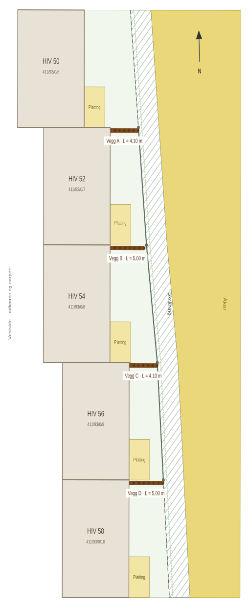
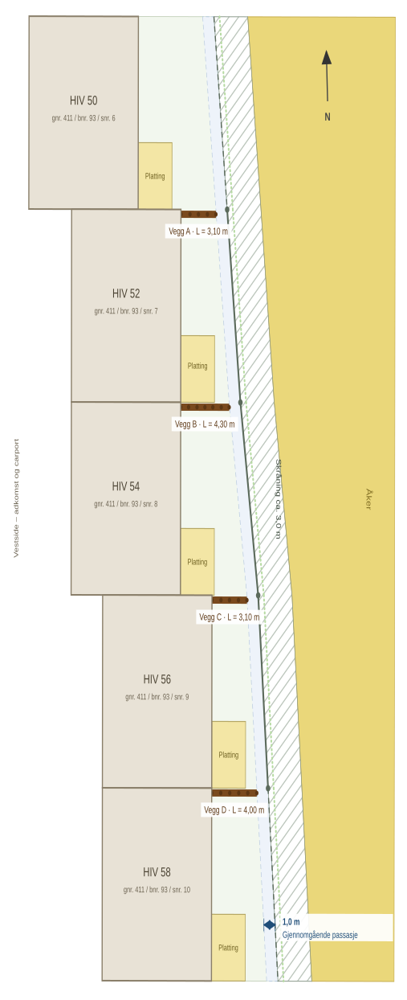
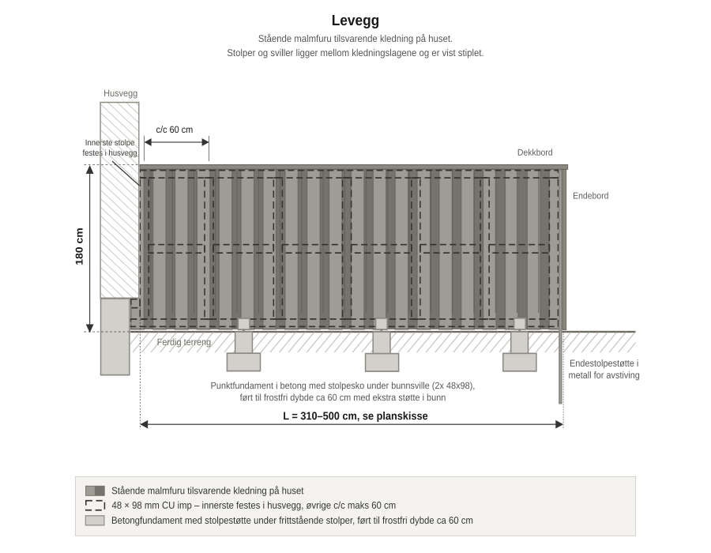
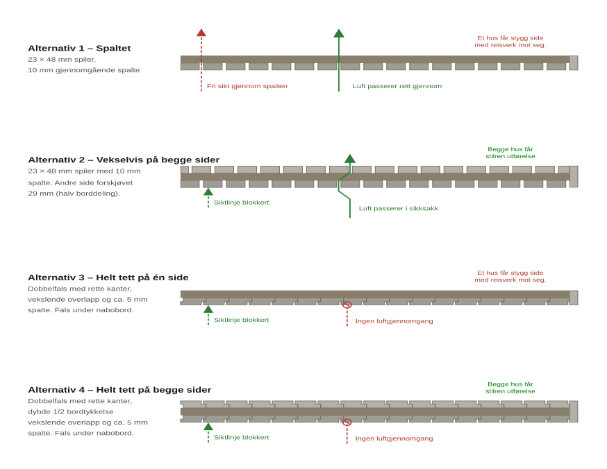

# Designforslag

Forslaget er å sette opp levegger i samme stil som den øvrige fasaden.
**Malmfuru med grå jernvitriolbehandling**, montert stående med rette bordkanter.
Slik fremstår leveggene som en forlengelse av byggets arkitektur.

Skråningen følger ikke rekka parallelt. Avstanden varierer med 1,20 m mellom det korteste og
det lengste snittet, og det kan gi ulik lengde på veggene avhengig av alternativet vi går for.

Veggene kan settes opp uavhengig av hverandre og i den takten partene blir enige om, men likevel ikke
mer enn 1 år etter at naboerklæringen er signert for å ivareta målet med ordensreglene.
Det er derfor ønskelig å få enighet om utformingen én gang slik at godkjenningen vi søker gjelder
alle vegger. Kostnadene avtales direkte mellom de to som deler veggen.

To alternative utstrekninger legges fram. Alternativene skiller seg kun i **hvor langt ut leveggen føres**.
Materialbruk, høyde, konstruksjon og utførelse er identisk, og samme alternativ bør velges for hele
rekka slik at uttrykket blir enhetlig.

### Alternativ 1 – fram til skråningsfoten, maks 5,0 m

Leveggen føres østover fra østfasaden, helt fram til foten av skråningen, opp til 5,0 m.

| Vegg | Avstand | Lengde på vegg | Merknad |
|------|---|--------|---------|
| A | 4,10 m | **4,10 m** | Går helt til skråningsfoten |
| B | 5,30 m | **5,00 m** | Stopper 0,30 m før foten – 5,0 m-grensen kommer først |
| C | 4,10 m | **4,10 m** | Går helt til skråningsfoten |
| D | 5,00 m | **5,00 m** | Grensen og skråningsfoten sammenfaller |

Samlet lengde: 18,20 m fordelt på fire vegger.

### Alternativ 2 – stopper 1,0 m før skråningsfoten, maks 5,0 m

Leveggen stopper 1,0 m før foten av skråningen, eller ved 5,0 m dersom det kommer først.

| Vegg | Avstand | Lengde på vegg | Merknad |
|------|---|--------|---------|
| A | 4,10 m | **3,10 m** | Avstanden til skråningen styrer |
| B | 5,30 m | **4,30 m** | Avstanden til skråningen styrer |
| C | 4,10 m | **3,10 m** | Avstanden til skråningen styrer |
| D | 5,00 m | **4,00 m** | Avstanden til skråningen styrer |

Samlet lengde: 14,50 m fordelt på fire vegger. 5,0 m-grensen slår aldri inn i dette alternativet.

### Sammenligning

| | Alternativ 1 | Alternativ 2 |
|---|---|---|
| Lengder | 4,10 · 5,00 · 4,10 · 5,00 m | 3,10 · 4,30 · 3,10 · 4,00 m |
| Samlet lengde | 18,20 m | 14,50 m |
| Skjerming | Tre av fire vegger går helt ut til skråningen | Alle stopper 1,0 m før skrøningen |
| Passasje langs skråningen | Ingen | Gjennomgående for hele rekka |
| Vedlikehold av skråningen | Må gjøres fra egen side av veggen | Kan gjøres fra begge sider uten å gå rundt |

Valget mellom alternativene er i hovedsak et spørsmål om hvorvidt det er ønskelig å kunne gå
langs skråningsfoten på tvers av rekka. Alternativ 2 gir en sammenhengende passasje bak alle fem
boligene.

Begge alternativene holder alle fire vegger innenfor 5,0 m. Hjemmelen i
[SAK10 § 4-1](Lover/byggesaksforskriften.md#4-1-tiltak-som-ikke-krever-sknad-og-tillatelse "FOR-2010-03-26-488 § 4-1 – tiltak som er unntatt fra søknadsplikt, blant annet levegg") første ledd bokstav f nr. 2
gjelder derfor uansett hvilket alternativ som velges, og det er ikke behov for noen minsteavstand
til grensen mellom seksjonene.

### Materialer og uttrykk

Leveggen utføres i **malmfuru med grå jernvitriolbehandling**, montert **stående**, slik at den
leses som en forlengelse av huset og ikke som et tilført element. Materialet gråner likt med huset
over tid, slik at fargeforskjellen som oppstår i starten jevner seg ut av seg selv.

> [!NOTAT]
> Det styret i praksis tar stilling til er **kledningstype, lengde og at utførelsen er lik for alle
> fire veggene** – ikke byggetekniske detaljer som stolpeavstand, svilltykkelse eller
> fundamenteringsmetode.

Tabellen viser utførelse og begrunnelse for hver del av konstruksjonen:

| Del | Utførelse | Begrunnelse |
|-----|-----------|-------------|
| Høyde | 1,8 m over ferdig terreng | Maksimal høyde uten søknadsplikt, jf. SAK10 § 4-1 første ledd bokstav f. Gir reell skjerming for stående person. |
| Reisverk | 48 × 98 mm CU-impregnert virke. Stolper settes c/c maks 0,80 m på dobbel bunnsvill, med 48 × 98 mm toppsvill og skråbånd i begge endefag | Tett stolpeavstand gir god innfesting for den stående kledningen og et svært stivt reisverk |
| Bunnsvill | Dobbel 48 × 98 mm CU-impregnert bunnsvill føres fra helt inntil grunnmuren og ut til avtalt lengde, festet i bjelkesko/beslag | Danner et sammenhengende og frostfritt underlag for reisverket |
| Topp- og endeavslutning | Gjennomgående dekkbord på toppen og loddrett endebord på fri uteside | Gir en rett, beskyttet avslutning |
| Fundament | Betongfundament til frostfri dybde, med ekstra betongmasse/utvidet fot nederst | Gir bedre hold mot sidekrefter enn en ren, smal betongsøyle |

### Drøftede alternativer for kledning

Fire kledningsalternativer er vurdert.

| | Innsynsskjerming | Vindskjerming |
|---|---|---|
| **Alternativ 1 – spaltet** | Fri sikt rett gjennom vinkelrett på veggen | God balanse mellom vindbeskyttelse og gjennomlufting |
| **Alternativ 2 – vekselvis kledning på begge sider** | Fullstendig, ingen gjennomgående siktlinje | God balanse mellom vindbeskyttelse og gjennomlufting |
| **Alternativ 3 – helt tett på én side** | Fullstendig | God vindbeskyttelse, ingen gjennomlufting |
| **Alternativ 4 – helt tett på begge sider** | Fullstendig | God vindbeskyttelse, ingen gjennomlufting |

## Rettslig grunnlag

- Levegg med høyde inntil 1,8 m og lengde inntil 5,0 m er unntatt søknadsplikt og kan plasseres
  inntil nabogrensen, jf. [SAK10 § 4-1](Lover/byggesaksforskriften.md#4-1-tiltak-som-ikke-krever-sknad-og-tillatelse "FOR-2010-03-26-488 § 4-1 – tiltak som er unntatt fra søknadsplikt, blant annet levegg")
  første ledd bokstav f nr. 2.
- Det er **ingen meldeplikt** til kommunen for levegg. Meldeplikten gjelder bare bygninger og
  tilbygg etter bokstav a, b og c.
- Unntaket forutsetter at tiltaket ikke strider mot reguleringsplan eller kommuneplan. Eiendommen
  er regulert i detaljreguleringsplanen «Griniskogen nordvest»
  [PlanID 3014_012320120011](https://arealplaner.no/indreostfold3118/arealplaner/166?bnr=93&gnr=411&knr=3118).
  Planen forbyr ikke levegger. **Reguleringsplanens § 4.3** krever at «gjerder/avskjerming» skal
  gis en estetisk utforming som harmonerer med boligbebyggelsen – nettopp det materialvalget her
  svarer på – og **reguleringsplanens § 4.1** tillater mindre frittstående anlegg utenfor
  byggegrensen. Kommuneplanens bestemmelse om levegg (**kommuneplanens § 5.9.1 bokstav j**) gjelder
  kun fritidsboliger, ikke boligområder som dette. Se [`Regelverk.md`](Regelverk.md) punkt 7 for
  full gjennomgang av begge planene.
- Leveggene skal holde seg innenfor arealformålet **B1 boligbebyggelse** (reguleringsplanen), og
  ikke føres inn i vegetasjonsskjermen som løper langs østsiden av planområdet.
- [Grannelova § 6](Lover/grannelova.md#6 "LOV-1961-06-16-15 § 6 – plikt til å varsle nabo i rimelig tid før tiltak") krever at naboene varsles i rimelig tid på
  forhånd. Her ivaretas dette ved at alle eierne i rekka involveres i utformingen før arbeidet
  starter.
- Utearealet er **fellesareal med enerett**, jf. sameiets vedtekter pkt. 2.4. Vedtektene pkt. 5.3
  krever forutgående godkjenning av styret når seksjonseier selv utfører utvendige arbeider.
- Fire levegger på samme matrikkelenhet kan i prinsippet bli vurdert samlet av kommunen, jf. DiBKs
  veiledning om at «mange mindre tiltak som utgjør en større helhet må ses samlet». Veggene står
  fritt fra hverandre med hele hagebredder imellom og danner ingen sammenhengende konstruksjon,
  men forholdet bør kanskje tas opp med kommunen.

Forslaget legges fram for styret med følgende spørsmål:

1. Kan styret godkjenne utformingen slik den er beskrevet her, jf. ordensreglene punkt 3 og
   vedtektene punkt 5.3?
2. Kan forslaget vedtas som en **felles standard for hele rekka HIV 50–58**, slik at hver enkelt
   vegg kan settes opp når partene er klare og naboerklæringen er signert, uten ny behandling?
3. Eierskap og vedlikeholdsplikt foreslås å inngå i eksisterende avtale om fellesareal med enerett,
   jf. vedtektene pkt. 2.4 og 7.10, i tillegg må ordensreglene gjelde. Hver seksjon har vedlikeholds-
   ansvar for sin side av veggen. Dersom veggen skades eller trenger videre vedlikehold eller reparasjon
   skal dette deles mellom de som deler på veggen. Styret bes vurdere om dette er tilstrekkelig, eller om det bør
   inngås en egen skriftlig avtale mellom partene for hver vegg.

> [!NOTAT]
> Trekanten AS er part i vegg C og vegg D som hjemmelshaver til seksjon 9, og er samtidig utbygger
> og representert i styret. Styret har selv pekt på at utbygger kan være inhabil i enkelte saker på
> grunn av dobbeltrollen, jf. styremøtereferat 10. juni 2026. Forslagsstiller ber styret vurdere om
> dette får betydning for behandlingen, slik at spørsmålet er avklart før vedtak fattes framfor i
> ettertid.

## Gjennomføring og økonomi

| Forhold | Løsning |
|---------|---------|
| Tidspunkt | Når partene til den enkelte veggen er tilgjengelige. Ingen frist foreslås, og veggene trenger ikke settes opp samtidig. |
| Utførelse | Avtales mellom de to partene som deler den enkelte veggen – se alternativer nedenfor |
| Kostnad | Bæres av de to partene til hver vegg og avtales direkte mellom dem. Tiltaket medfører ingen felleskostnader for sameiet. |
| Vedlikehold | Følger samme prinsipp som kostnaden og skriftliggjøres i avtalen mellom partene |
| Sameiets utgift | Ingen |

### Gjennomføring – alternativer

Hvem som utfører arbeidet avtales fritt mellom de to partene til hver vegg. Aktuelle alternativer:

- **Dugnad** – partene bygger veggen selv.
- **Geir Moen AS** – innhente tilbud fra Geir Moen AS.
- **Andre** – forslagsstiller har god erfaring med BSS fra Ski fra et tidligere prosjekt. Andre tips
  til entreprenør mottas med takk.

Ettersom tiltaket ikke belaster fellesøkonomien, kommer vedtektene pkt. 7.10 om bomiljøtiltak med
økonomiske konsekvenser for seksjonseierne i fellesskap ikke til anvendelse.

> [!NOTAT]
> Kostnads- og vedlikeholdsdelingen bør skriftliggjøres for hver vegg før arbeidet starter, selv om
> partene er enige. En kort skriftlig avtale koster ingenting nå og forebygger uenighet ved senere
> eierskifte – noe som er særlig aktuelt for vegg C og D, der seksjon 9 skal selges.

## Det som gjenstår

Følgende må avklares før forslaget kan gjennomføres. Fullstendig liste med status ligger i
[`Avklaringer.md`](Avklaringer.md).

- [x] ~~Avstanden fra østfasade til foten av skråningen er målt for hver av de fire veggene:
  4,10 m, 5,30 m, 4,10 m og 5,00 m.~~
- Terrengfallet langs hver trasé må måles, slik at det kan avgjøres om veggene skal trappes.
- Reguleringsplanen er funnet og gjennomgått. Det gjenstår å få bekreftet av kommunen om levegger
  utløser krav om oppdatert utomhusplan etter planens § 4.5, og om de fire veggene skal vurderes
  samlet. Forespørsel er skrevet, jf.
  [`Mail/2026-08-02-Kommunen-planstatus.md`](Mail/2026-08-02-Kommunen-planstatus.md).
- Formålsgrensen mellom B1 og vegetasjonsskjermen øst for rekka bør sammenholdes med skråningsfoten,
  slik at ingen vegg føres inn i vegetasjonsskjermen.
- Det må kontrolleres at det ikke ligger kabler, rør eller drenering i fundamentlinjene.
- Eierne i rekka må gi sin tilslutning til alternativ og utførelse, og signere naboerklæringen for
  den veggen de er part i. For seksjon 9 gjelder dette Trekanten AS inntil boligen er solgt.
