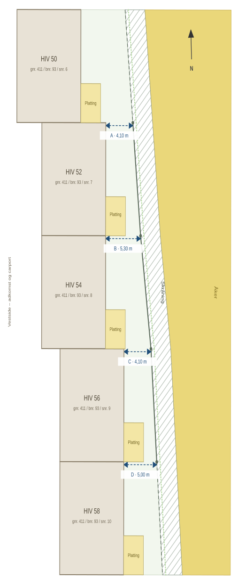

# Levegger – rekka Helge Ingstads vei 50–58

Uteoppholdsarealene mellom de fem boligene i rekka er i dag helt uskjermet.
Uteplassene ligger rett ved siden av hverandre på østsiden av husene, uten noen form for skille.
Innsynet er fritt begge veier, og bruken av egen uteplass foregår i praksis i naboens synsfelt. Det
begrenser bruken av arealene mer enn nødvendig – for alle parter, i begge retninger. Rekka ligger
dessuten åpent til, og uteplassene er utsatt for vind.

Behovet for skjerming er felles, men initiativet kommer naturlig fra én seksjon om gangen.
Settes det opp én vegg nå, én om to år og én om fem, ender rekka lett opp med fire ulike løsninger
i samme fasadeflate. Sameiets trivsels- og ordensregler punkt 3 sier at «det bør tilstrebes å finne
felles løsninger for å opprettholde et enhetlig og moderne uttrykk på boenhetene», og vedtektene
punkt 5.3 forutsetter at utvendige endringer skjer etter «en samlet plan». Derfor legges saken fram
som ett ferdig designgrunnlag for alle fire skillene, slik at styret kan ta stilling til utformingen
én gang – og den enkelte veggen kan settes opp når det passer for de to som deler den.

Sameiets regler krever skriftlig søknad til styret med beskrivelse og tegninger, tekniske
undersøkelser bekostet av søker, og **skriftlig samtykke fra berørte naboer**. Selve tiltaket er
unntatt søknadsplikt etter SAK10 § 4-1 så lenge veggen er inntil 1,8 m høy og inntil 5,0 m lang fra
husvegg. Det som gjenstår er derfor ikke det offentlige regelverket, men enigheten internt
i rekka: felles utforming og valg av lengdealternativ.

Sameiet kan ikke belastes noen kostnader. Kostnadene avtales direkte mellom de to eierne som deler
hver vegg. Rekka er boligtype B, seksjon 6–10, og disse fem har etter vedtektene pkt. 3.2 og 5.1 et
solidarisk ansvar for alt ytre vedlikehold på bygget, fordelt likt. Leveggene er derfor utformet
selvbærende og uten innfesting i østfasaden, slik at de ikke trekkes inn i byggets ytre vedlikehold.
Se [`Regelverk.md`](Regelverk.md) punkt 6.4.

## Rekka og de fire veggene

Rekka går nord–sør, uteoppholdsarealene ligger på østsiden, og leveggene går østover fra husenes
østfasade. Husene står forskjøvet i forhold til hverandre: HIV 50 er ca 4 m lenger vest enn HIV 52 og
54, som igjen er ca 2 m lenger vest enn HIV 56 og 58.

Forslaget omfatter fire vegger:

| Vegg | Mellom | Seksjoner | A (målt) | Parter |
|------|--------|-----------|----------|--------|
| A | HIV 50 og HIV 52 | 6 og 7 | 4,10 m | Nessestrand · Storhaug |
| B | HIV 52 og HIV 54 | 7 og 8 | 5,30 m | Storhaug · Wilhelmsen/Hagen |
| C | HIV 54 og HIV 56 | 8 og 9 | 4,10 m | Wilhelmsen/Hagen · Trekanten AS (usolgt) |
| D | HIV 56 og HIV 58 | 9 og 10 | 5,00 m | Trekanten AS (usolgt) · Takvam/Vikeby |
